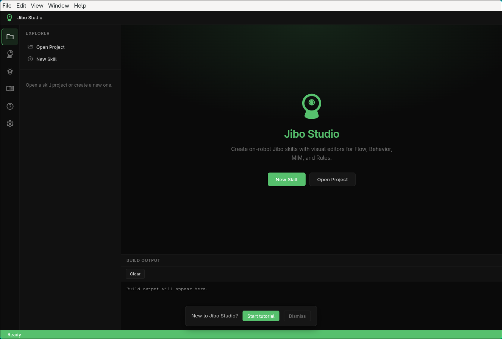
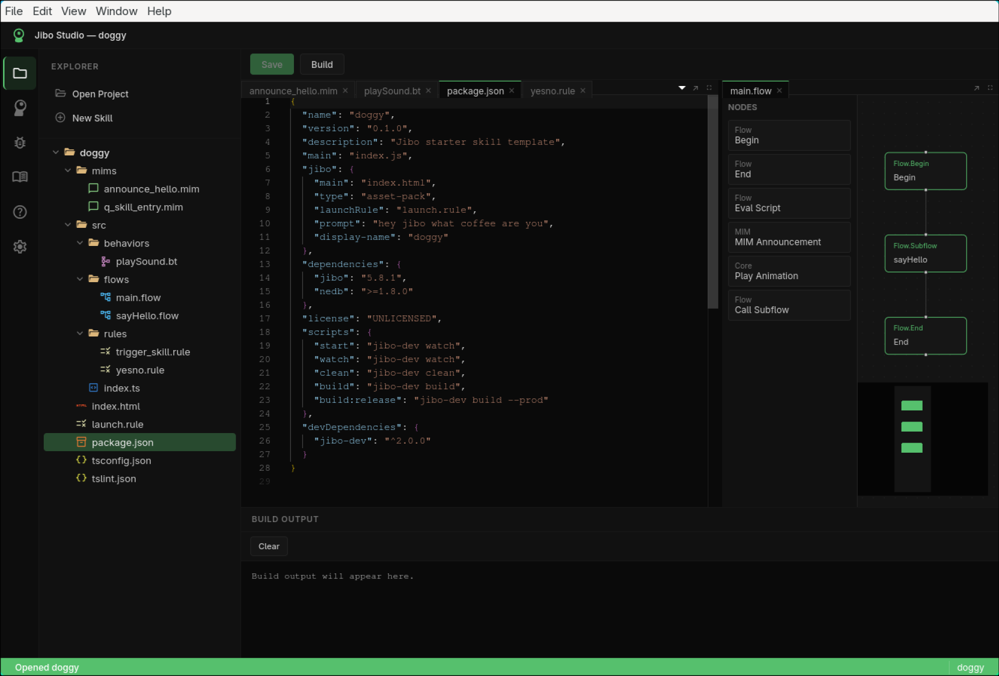

# Jibo Studio

Desktop IDE for creating on-robot Jibo Electron skills.

**JiboScript** (default) is a Python-like skill language (`.jibo`) that compiles into the legacy Flow, Behavior, MIM, and Rules formats Jibo already understands. Visual editors remain available for **legacy** projects.

## Images




## Requirements

- Linux (v1)
- Node.js 18+ (for running Jibo Studio itself)

The repository includes a complete offline vendor toolchain (`vendor/node6`, `vendor/skill-deps`, `vendor/sdk-toolchain`). Fresh clones do **not** need `npm run vendor` unless you are regenerating those assets.

## Development

```bash
npm install
npm run dev
```

### Interface

Opening or creating a JiboScript project automatically opens `skill.jibo` in the editor. The
sidebar (file explorer, robot panel, guide, etc.) and the build output panel are hidden by default
to keep the editor uncluttered — click an icon in the activity bar (left edge) to open a sidebar
view, and click it again to hide it. The **Output** button in the editor toolbar toggles the build
output panel, which also opens automatically when you Build, Watch, or hit a compile error.

## JiboScript

New skills create a `skill.jibo` source file. See **[docs/JIBOSCRIPT.md](docs/JIBOSCRIPT.md)** for
the full language reference (also available inside Jibo Studio via the "JiboScript Guide" sidebar
icon). Quick example:

```python
skill:
  name = "my-skill"
  display = "My Skill"
  launch = "hey jibo"
  prompt = "Do something"

flow main:
  call sayHello with notepad = notepad
  end

flow sayHello:
  announce announce_hello with currentSpeaker = notepad.currentSpeaker
  end

mim announce_hello:
  type = announcement
  say "Hello ${currentSpeaker}!" category = "Entry-Core" sub = "AN"
```

Save or Build compiles this into:

- `launch.rule`
- `src/flows/*.flow`
- `src/behaviors/*.bt`
- `src/rules/*.rule`
- `mims/*.mim`

Then `jibo-dev` (Node 7, bundled) produces robot-runnable JS and `.fst` files.

### Project modes

| Mode | Detection | Edit |
|------|-----------|------|
| **JiboScript** (`dsl-v1`) | `jibo.sourceFormat: "dsl-v1"` or `skill.jibo` | Edit `.jibo`; generated artifacts are read-only |
| **Legacy** | `jibo.sourceFormat: "legacy-artifacts"` | Edit `.flow` / `.bt` / `.rule` / `.mim` as before |

Opening a classic skill that Studio has never seen (no `sourceFormat`, no `skill.jibo`) shows a
choice dialog: **Keep legacy** (records the choice so it won’t ask again) or **Migrate to
JiboScript** (generates `skill.jibo` from the existing artifacts, then opens that file). Migration
is best-effort — branching flows and uncommon nodes may need a quick review after.

## Vendor SDK Toolchain

Maintainers can regenerate offline toolchain assets:

```bash
npm run vendor
```

This downloads Jibo npm tarballs from pvindex, installs `vendor/skill-deps/node_modules`, caches the robot CLI under `vendor/sdk-toolchain`, and bundles Node 7.10.1 under `vendor/node6`. Releases and committed vendor trees ship these so end users need no pvindex access.

## Build & Package

```bash
npm test
npm run build
npm run package:linux
```

## License

3-clause BSD — see [license](license).
